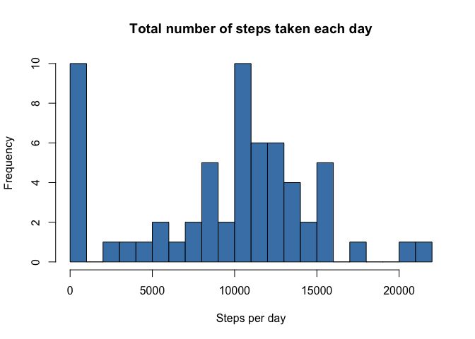
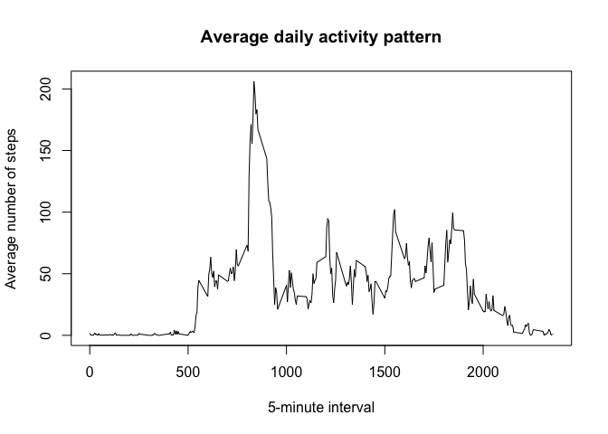
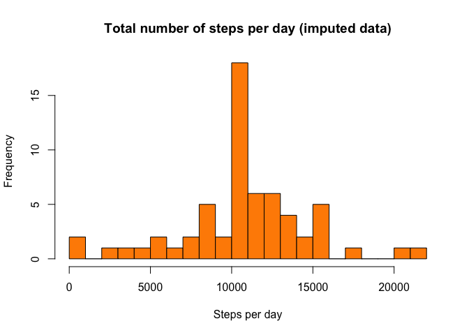
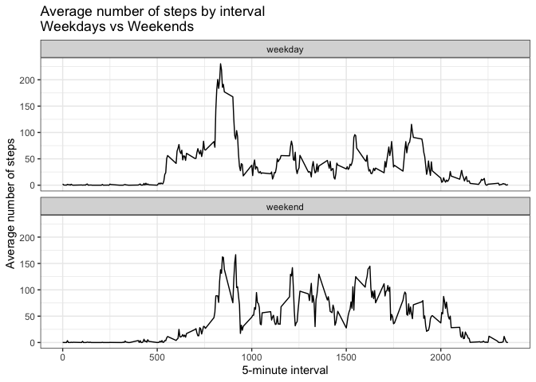

## Loading and preprocessing the data


``` r
activity <- read.csv("activity.csv", stringsAsFactors = FALSE)

str(activity)
```

```
## 'data.frame':	17568 obs. of  3 variables:
##  $ steps   : int  NA NA NA NA NA NA NA NA NA NA ...
##  $ date    : chr  "2012-10-01" "2012-10-01" "2012-10-01" "2012-10-01" ...
##  $ interval: int  0 5 10 15 20 25 30 35 40 45 ...
```

``` r
activity$date <- as.Date(activity$date)
summary(activity$date)
```

```
##         Min.      1st Qu.       Median         Mean      3rd Qu.         Max. 
## "2012-10-01" "2012-10-16" "2012-10-31" "2012-10-31" "2012-11-15" "2012-11-30"
```

---

## What is mean total number of steps taken per day?


``` r
daily_steps <- activity %>%
  group_by(date) %>%
  summarise(total_steps = sum(steps, na.rm = TRUE))

head(daily_steps)
```

```
## # A tibble: 6 × 2
##   date       total_steps
##   <date>           <int>
## 1 2012-10-01           0
## 2 2012-10-02         126
## 3 2012-10-03       11352
## 4 2012-10-04       12116
## 5 2012-10-05       13294
## 6 2012-10-06       15420
```


``` r
hist(daily_steps$total_steps,
     breaks = 20,
     main   = "Total number of steps taken each day",
     xlab   = "Steps per day",
     col    = "steelblue")
```

<!-- -->


``` r
mean_steps   <- mean(daily_steps$total_steps)
median_steps <- median(daily_steps$total_steps)

mean_steps
```

```
## [1] 9354.23
```

``` r
median_steps
```

```
## [1] 10395
```

---

## What is the average daily activity pattern?


``` r
interval_pattern <- activity %>%
  group_by(interval) %>%
  summarise(mean_steps = mean(steps, na.rm = TRUE))

head(interval_pattern)
```

```
## # A tibble: 6 × 2
##   interval mean_steps
##      <int>      <dbl>
## 1        0     1.72  
## 2        5     0.340 
## 3       10     0.132 
## 4       15     0.151 
## 5       20     0.0755
## 6       25     2.09
```


``` r
plot(interval_pattern$interval, interval_pattern$mean_steps,
     type = "l",
     xlab = "5-minute interval",
     ylab = "Average number of steps",
     main = "Average daily activity pattern")
```

<!-- -->


``` r
max_row <- interval_pattern[which.max(interval_pattern$mean_steps), ]
max_row
```

```
## # A tibble: 1 × 2
##   interval mean_steps
##      <int>      <dbl>
## 1      835       206.
```

---

## Imputing missing values


``` r
total_na <- sum(is.na(activity$steps))
total_na
```

```
## [1] 2304
```


``` r
activity_imputed <- activity %>%
  left_join(interval_pattern, by = "interval")

# Replace NA steps with mean for that interval
activity_imputed$steps[is.na(activity_imputed$steps)] <-
  activity_imputed$mean_steps[is.na(activity_imputed$steps)]

# Drop helper column
activity_imputed$mean_steps <- NULL

sum(is.na(activity_imputed$steps))
```

```
## [1] 0
```


``` r
daily_steps_imp <- activity_imputed %>%
  group_by(date) %>%
  summarise(total_steps = sum(steps))

hist(daily_steps_imp$total_steps,
     breaks = 20,
     main   = "Total number of steps per day (imputed data)",
     xlab   = "Steps per day",
     col    = "darkorange")
```

<!-- -->


``` r
mean_steps_imp   <- mean(daily_steps_imp$total_steps)
median_steps_imp <- median(daily_steps_imp$total_steps)

mean_steps_imp
```

```
## [1] 10766.19
```

``` r
median_steps_imp
```

```
## [1] 10766.19
```

---

## Are there differences in activity patterns between weekdays and weekends?


``` r
activity_imputed$day_of_week <- weekdays(activity_imputed$date)

activity_imputed$day_type <- ifelse(activity_imputed$day_of_week %in% c("Saturday", "Sunday"),
                                    "weekend", "weekday")

activity_imputed$day_type <- factor(activity_imputed$day_type,
                                    levels = c("weekday", "weekend"))

table(activity_imputed$day_type)
```

```
## 
## weekday weekend 
##   12960    4608
```


``` r
interval_daytype <- activity_imputed %>%
  group_by(interval, day_type) %>%
  summarise(mean_steps = mean(steps), .groups = "drop")

head(interval_daytype)
```

```
## # A tibble: 6 × 3
##   interval day_type mean_steps
##      <int> <fct>         <dbl>
## 1        0 weekday      2.25  
## 2        0 weekend      0.215 
## 3        5 weekday      0.445 
## 4        5 weekend      0.0425
## 5       10 weekday      0.173 
## 6       10 weekend      0.0165
```


``` r
ggplot(interval_daytype, aes(x = interval, y = mean_steps)) +
  geom_line() +
  facet_wrap(~ day_type, nrow = 2, ncol = 1) +
  labs(title = "Average number of steps by interval\nWeekdays vs Weekends",
       x = "5-minute interval",
       y = "Average number of steps") +
  theme_bw()
```

<!-- -->

